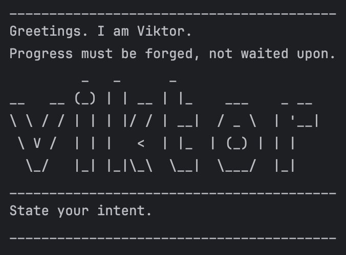

# Viktor User Guide


## INTRODUCTION

**"Progress must not wait for the hesitant."** – Viktor

Viktor is not just a chatbot. He is a visionary, a guide to efficiency, a machine of logic. With him, you will master your tasks, optimize your time, and eliminate inefficiency. Tasks are **automatically saved**, for the future is built upon persistence.

---

## INITIALIZATION

### ⚙️ SYSTEM BOOT: DOWNLOAD & RUN

Ensure **Java 11 or later** is installed. Then execute:

```sh
javac Viktor.java
java Viktor
```

**Welcome Interface:**

```sh
Greetings. I am Viktor.
Progress must be forged, not waited upon.
State your intent.

         _   _      _                  
__   __ (_) | | __ | |_    ___    _ __ 
\ \ / / | | | |/ / | __|  / _ \  | '__|
 \ V /  | | |   <  | |_  | (_) | | |   
  \_/   |_| |_|\" + "_\  \__|  \___/  |_|   
```

---

## CORE FUNCTIONALITY

### 🛠 **TASK CREATION MODULE**

Viktor supports three essential task types:
- **To-Do:** Simple objectives.
- **Deadlines:** Objectives bound by time.
- **Events:** Timed occurrences requiring precision.

---

### 🔹 **INITIALIZE: TO-DO TASK**

#### **COMMAND:**
```sh
todo <task description>
```
#### **EXAMPLE:**
```sh
todo Upgrade Hexcore
```
#### **SYSTEM RESPONSE:**
```
Task acquired: [T][ ] Upgrade Hexcore.
Efficiency is paramount.
```

---

### ⏳ **INITIALIZE: DEADLINE TASK**

#### **COMMAND:**
```sh
deadline <task description> /by <yyyy-MM-dd>
```
#### **EXAMPLE:**
```sh
deadline Enhance prosthetic /by 2025-03-10
```
#### **SYSTEM RESPONSE:**
```
Task acquired: [D][ ] Enhance prosthetic (by: Mar 10 2025)
Efficiency is paramount.
```

---

### 📅 **INITIALIZE: EVENT TASK**

#### **COMMAND:**
```sh
event <task description> /from <start time> /to <end time>
```
#### **EXAMPLE:**
```sh
event Zaun-Piltover Summit /from 3pm /to 5pm
```
#### **SYSTEM RESPONSE:**
```
Task acquired: [E][ ] Zaun-Piltover Summit (from: 3pm to: 5pm)
Efficiency is paramount.
```

---

### 📃 **TASK LOG: REVIEW TASKS**

#### **COMMAND:**
```sh
list
```
#### **SYSTEM RESPONSE:**
```
Task registry active:
1. [T][ ] Upgrade Hexcore
2. [D][ ] Enhance prosthetic (by: Mar 10 2025)
3. [E][ ] Zaun-Piltover Summit (from: 3pm to: 5pm)
Efficiency must be maintained.
```

---

### 🔍 **TASK ANALYSIS: LOCATE TASKS**

#### **COMMAND:**
```sh
find <keyword>
```
#### **EXAMPLE:**
```sh
find Hexcore
```
#### **SYSTEM RESPONSE:**
```
Pattern identified. Tasks relevant to "Hexcore":
1. [T][ ] Upgrade Hexcore
Refinement leads to optimization.
```

---

### ✅ **TASK COMPLETION: MARK AS DONE**

#### **COMMAND:**
```sh
done <task number>
```
#### **EXAMPLE:**
```sh
done 2
```
#### **SYSTEM RESPONSE:**
```
Progress achieved:
[D][X] Enhance prosthetic (by: Mar 10 2025)
```

---

### ❌ **TASK REMOVAL: DELETE TASK**

#### **COMMAND:**
```sh
delete <task number>
```
#### **EXAMPLE:**
```sh
delete 1
```
#### **SYSTEM RESPONSE:**
```
_________________________________________
Task purged: [T][ ] Upgrade Hexcore
Only the essential remains.
Now you have 4 tasks in the list.
_________________________________________
```

---

### 🔄 **TASK REVERSAL: UNMARK TASK**

#### **COMMAND:**
```sh
unmark <task number>
```
#### **EXAMPLE:**
```sh
unmark 2
```
#### **SYSTEM RESPONSE:**
```
_________________________________________
Task unmarked:
[D][ ] Enhance prosthetic (by: Mar 10 2025)
Regression is a flaw to be corrected.
_________________________________________
```

---

### 💾 **DATA PERSISTENCE: AUTOMATIC SAVE & LOAD**

- All tasks are stored in `data/viktor.txt`.
- On startup, previously saved tasks are reloaded.

---

### 🔚 **SYSTEM SHUTDOWN**

#### **COMMAND:**
```sh
bye
```
#### **SYSTEM RESPONSE:**
```
There is still much work to be done.
Progress does not cease. Neither should you.
Farewell.
```

---

## COMMAND REFERENCE MATRIX

| **COMMAND** | **DESCRIPTION**        | **EXAMPLE**                             |
|------------|----------------------|----------------------------------------|
| `todo`      | Log a To-Do task     | `todo Upgrade Hexcore`                 |
| `deadline`  | Register a Deadline task  | `deadline Enhance prosthetic /by 2025-03-10` |
| `event`     | Register an Event task    | `event Zaun-Piltover Summit /from 3pm /to 5pm` |
| `list`      | Display all tasks       | `list`                                 |
| `find`      | Identify tasks by keyword | `find Hexcore`                      |
| `done`      | Confirm task completion  | `done 2`                               |
| `unmark`    | Revert task completion | `unmark 2`                            |
| `delete`    | Remove a task         | `delete 1`                             |
| `bye`       | Exit system      | `bye`                                  |

---

## FINAL STATEMENT

**"The key to progress is efficiency. And efficiency is what I offer you."**

Engage, optimize, evolve. Viktor will guide you to a future of flawless execution.